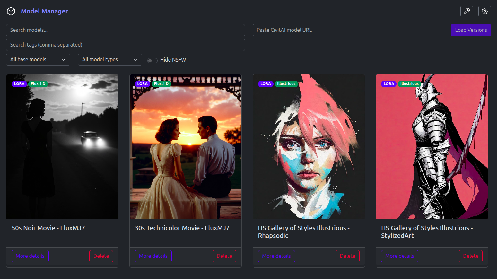

# Model Manager
This is a desktop application to download and manage models for local image generation.

## Setup
1. Run `go install` in \backend\
2. Run `npm i` in \frontend\
3. In the main directory, run `go run .\backend\main.go`
4. In the \frontend\ directory, run `npm run dev`

## Gallery Management
Use the model detail page to upload additional images or remove existing gallery
images from a version. The uploaded image will be scanned for embedded metadata
and displayed alongside the image.

### API Endpoints
- `POST /api/versions/:id/images` – upload a gallery image. Form field `file`
  should contain the image. Returns the created `VersionImage` record.
- `DELETE /api/versions/:id/images/:imgId` – remove a gallery image.

## Todo
- Library management
    - Add a tag to multiple models at once
    - Remove a tag from multiple models at once
    - A way to see all current tags in the library and see all models with that tag
- Civitai Import
    - Add check to ensure that model files with the same name don't overrite existing models in the folder
- Settings
    - Add a setting to change the models and image folder locations
- Utilities
    - Statistics about the library size broken down by several different factors
        - Model Type
        - Base Model
        - Models vs images
    - A tool that will scan the library folder and find any models that are missing from the library
